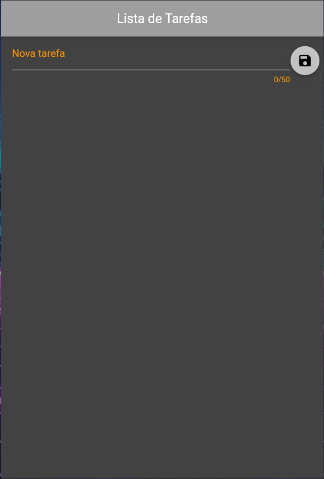
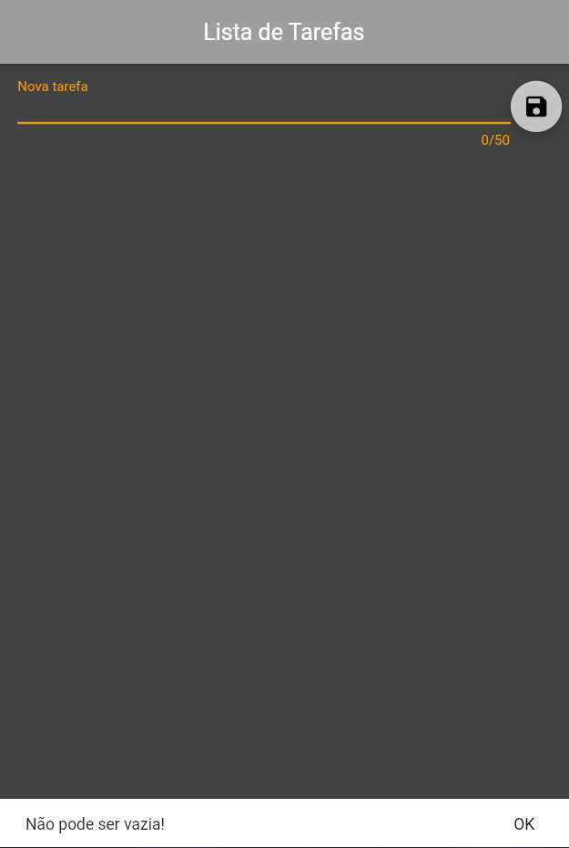
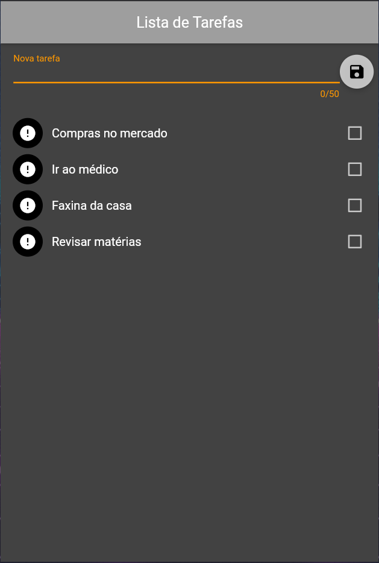
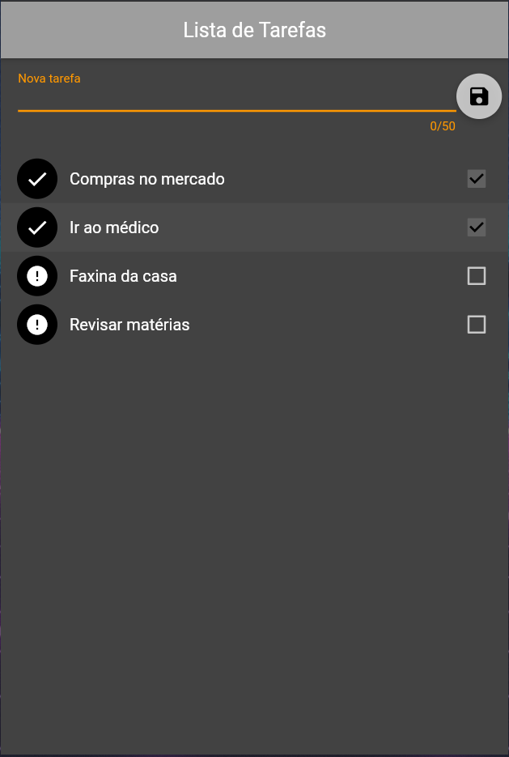
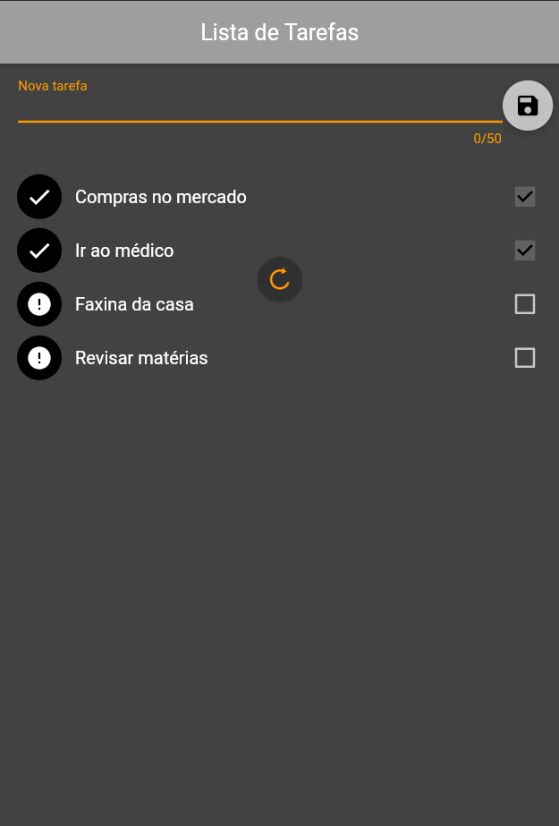
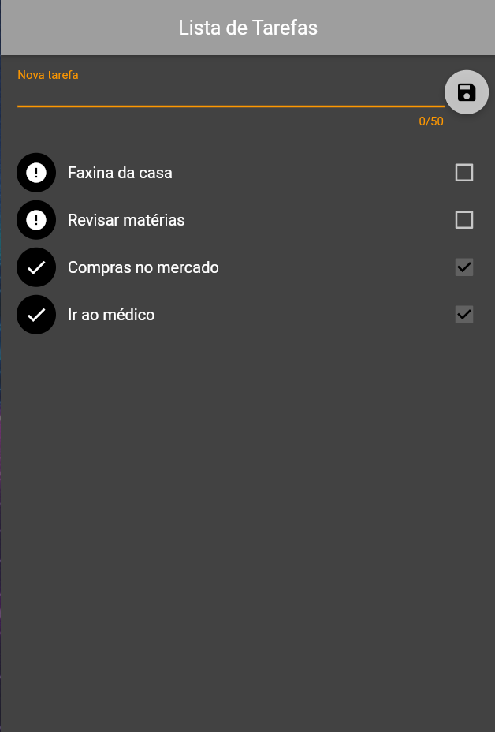
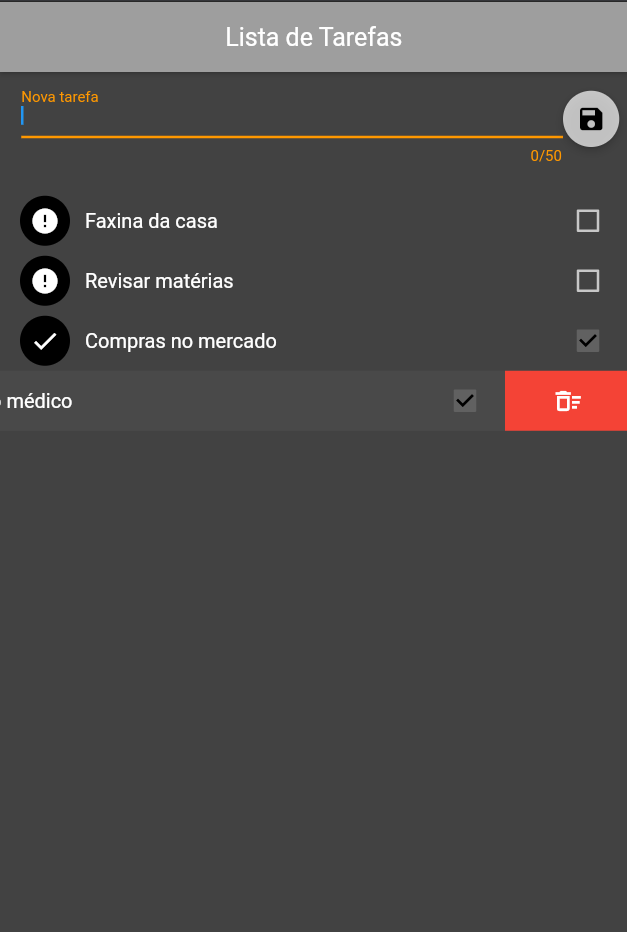
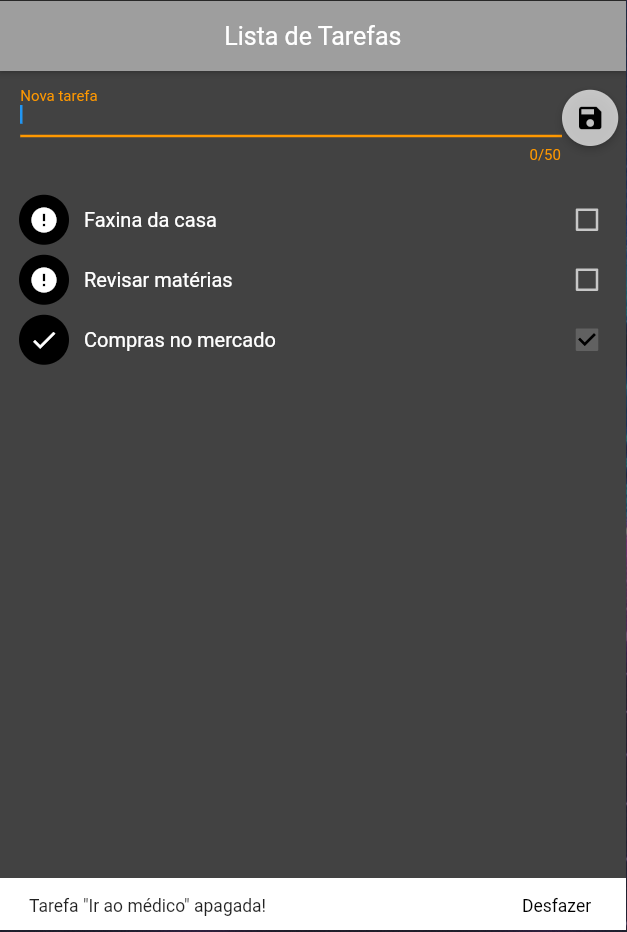

# ToDo List
Um projeto Flutter em Dart onde se foi criado uma

## Tecnologias

* Dart
* Flutter

## Funcionalidades
* Inserir: 
  * Insira uma tarefa a ser realizada no campo informado
  * Aviso nota não pode ser vazia

* Salvar:
  * A tarefa sera salva e automaticamente alocada logo abaixo em uma lista

* Checked(Concluída):
  * Marcar o check ao lado da tarefa para sinalizar como concluída
  * Após marcar o item como "checked" e atualizar o app os items "checked" são movidos para abaixo dos "unchecked"

* Unchecked(Não concluída):
  * Retirar o check ao lado da tarefa para sinalizar que não foi concluída

* Excluir:
  * Excluir a uma tarefa ao arrastar a mesma da direita para esquerda até sinalizar o simbolo de uma lixeira(denominando a exclusão)
  * Aviso pós exclusão do item se deseja desfazer a ação

## Layout
        
